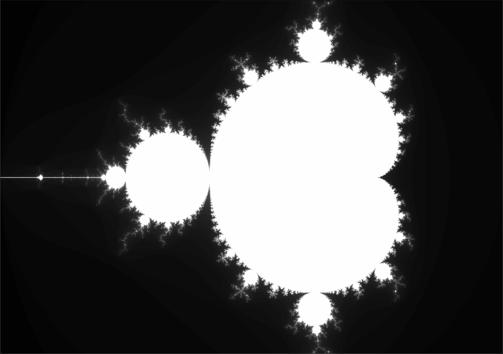

# Mandelbrot set

The mandelbrot set constitutes the complex set of numbers ```c``` where the series
``` z(n+1) = z(n) + c``` does not diverge. This project uses SDL2 to render the pixels on screen.

